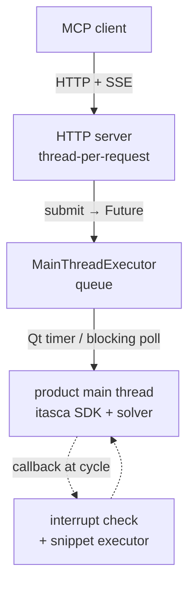

# itasca-mcp-bridge

[English](README.md) | [简体中文](README.zh-CN.md)

[](https://pypi.org/project/itasca-mcp-bridge/)

Runtime bridge that runs inside an ITASCA product process (PFC, FLAC, ...)
and exposes the product's Python SDK as an HTTP API, enabling execution
tools for MCP servers such as [itasca-mcp](https://pypi.org/project/itasca-mcp/).

The bridge is product-neutral: it drives the host through the shared ITASCA
command language / Python SDK rather than any product-specific API.

## Features

- **Async tasks with progress polling.** Submit a long simulation script
  (`execute_task` message) and poll its status and paginated output while
  it runs (`check_task_status`).
- **Live REPL during a run.** Send `execute_code` against the running
  task's namespace at any time to inspect state or tune parameters
  mid-cycle — no need to bake probes into the script up front.
- **Graceful interrupt.** Stop a long cycling task on request
  (`interrupt_task`) without killing the product.
- **Unified output capture.** Python `print` and product console output
  (`itasca.command()` tables, list dumps, summaries) are interleaved in
  execution order in the task log.

## Architecture

ITASCA's Python SDK is main-thread-only, so the bridge keeps the
simulation on the main thread and serves remote requests around it with
three parts:



- **HTTP server (thread-per-request).** A stdlib `http.server` (no asyncio,
  no third-party dependency) serves each request on its own thread, hands the
  work to the main thread, and awaits a `Future`. It never touches the SDK
  directly, so lightweight calls (status, interrupt) stay responsive even
  while a long task runs. Request/response is plain `POST /<command>`; the one
  server→client doorbell (`task_status_changed`) is pushed over a single
  long-lived `GET /events` Server-Sent Events stream.
- **Main-thread queue.** `MainThreadExecutor` holds a thread-safe queue
  that the main thread drains — via a Qt timer in GUI mode, or a blocking
  poll in console mode. Submitted task scripts (`execute_task`) run here.
- **Cycle-gap callbacks.** A cycling task holds the main thread, so two
  `itasca.set_callback` hooks keep it reachable: an interrupt check that
  stops the run (`interrupt_task`), and a snippet executor that runs
  `execute_code` REPL calls in the gaps between cycles — sharing the
  task's `__main__` namespace for live inspection and tuning.

## HTTP protocol

The bridge is the source of truth for the wire contract — MCP servers such
as itasca-mcp are clients of it. Each request is a `POST /<command>` whose
body is a JSON object carrying a `request_id`; the JSON response echoes the
`request_id`. The server→client doorbell rides a single long-lived
`GET /events` SSE stream (payload-free `task_status_changed` events that
prompt the client to re-poll), and `GET /health` is a liveness probe. The
commands are product-neutral:

| `POST /<command>` | Purpose | Key body fields |
|---|---|---|
| `execute_task` | Submit a file-backed script as a tracked async task | `task_id`, `script_path`, `description` |
| `check_task_status` | Poll a task's status and paginated log | `task_id`, `skip_newest`, `limit`, `filter_text` |
| `list_tasks` | List known tasks | `offset`, `limit` |
| `interrupt_task` | Request a graceful interrupt of a running task | `task_id` |
| `execute_code` | Run a snippet in the running task's `__main__` (sync REPL) | `code`, `timeout_ms` |
| `list_dialogs` | What the product is asking, with the buttons it is asking it with | — |
| `answer_dialog` | Click one of those buttons | `id`, `button` |

`GET /dialogs` is the same payload as `list_dialogs` for a client that only
speaks curl. See [Start with the product](#start-with-the-product) for what
these are for.

## Quick Start

Run inside the product's Python (GUI IPython console or console CLI):

### Install from PyPI

In the product's IPython console:

```python
from pip._internal.cli.main import main as pip_main
pip_main(["install", "--user", "itasca-mcp-bridge"])

import itasca_mcp_bridge
itasca_mcp_bridge.start()
```

### Start with the product

Typing those two lines is fine once. It is also why a bridge is only up when
somebody remembers to start it, which is the wrong default for a server whose
whole point is that a client can connect to it. `autostart` writes a
`sitecustomize.py` into the product's embedded Python, and CPython imports
that name at every interpreter startup:

```console
$ python -m itasca_mcp_bridge autostart install
$ python -m itasca_mcp_bridge autostart status
$ python -m itasca_mcp_bridge autostart remove
```

`install` searches the usual ITASCA install roots (`--root` to point it
somewhere else, repeatable). Start the product; within a few seconds
`http://localhost:9001/health` answers with `"runtime_mode": "gui"`. The hook
logs what it did to `%TEMP%\itasca_mcp_bridge_autostart.log`, and starts
nothing on a machine where a bridge is already listening.

It is written to be safe inside someone's GUI. Only an ITASCA product binary
arms it (`pfc2d700_gui.exe`, not the `exe64/python36/python.exe` the
self-upgrade runs pip with). Readiness is polled on a daemon thread and
`start()` is queued onto the **GUI thread**, because a Qt timer installed
from any other thread never ticks — `/health` answers 200 while every
submitted task hangs. Console builds are left alone. A `sitecustomize.py`
that is not ours is backed up rather than replaced.

The product raises a per-revision notice window listing what changed. It is
left alone by default: a bridge that closes windows it did not cause is
making a call that belongs to the person at the keyboard.

What the hook does do is *watch* those windows, for the life of the process,
and report each new dialog once — whether or not it is allowed to close
anything. A dialog raised before the first engine command is outside
`utils/modal_guard`'s reach, since that only polls while the bridge is inside
an engine command, and by definition nothing here is yet. It does **not** hang
the bridge: a Qt modal runs a nested event loop and the task pump keeps
ticking inside it (measured — a task still round-trips with the box up). Nor
does it corrupt what the bridge returns: a two-button `QMessageBox` held open
across a `plot export bitmap` produced a file byte-identical to the one
exported with no box on screen at all (43359 bytes, same sha256, 197 balls in
the plot). What is left is silence — nothing fails, so nothing else tells you
the box is there, and an unanswered box keeps coming back to the front of the
screen it is on. The log line is the only symptom:

```text
a dialog is waiting for a human, leaving it alone: Recover Project File  (nothing else reports it; GET /dialogs lists its buttons)
```

Setting `ITASCA_MCP_BRIDGE_AUTOSTART_DISMISS_WINDOWS=1` turns the same pass
into a hand. It closes the revision notice, and answers any dialog whose
visible buttons are *all* acknowledgements — `Ok`, `Close`, `Continue`,
`Dismiss`. Clicking one of those is not a decision: the box has exactly one
possible outcome, so taking it leaves the person at the keyboard nothing they
could have wanted instead. Everything else still stands and is still reported
— a recovery prompt offering `Open`/`Discard`, a save confirmation with
`OK`/`Cancel`, anything with a `Yes` beside its `No`. `close()` is not enough
for these and that is not a stylistic point: Qt refuses to close a widget that
is inside a modal `exec_()`, returns without raising, and the box stays up.
Which is why a notice is *closed* and a no-choice dialog is *answered*. On
PFC2D 7.00.161 the first answer produced two more, so this is a sweep rather
than a click; the last of the three was an `Ok`-only box reporting an
unrepeatable model state, which blocks the product and offers no way past.

That switch is the hook's own policy, and a policy written down in advance
cannot cover a box nobody has seen yet — which is exactly the position of
anyone whose only copy of the product is the one they have. So the same
watch also publishes what it sees, and lets a client answer instead:

```console
$ curl -s localhost:9001/dialogs
{"status": "success", "data": {"dialogs": [
  {"id": 1, "title": "Recover Project File",
   "text": "The project file was not saved...",
   "buttons": ["Open", "Discard"], "asks_nothing": false}]}}

$ curl -s -X POST localhost:9001/answer_dialog \
    -d '{"request_id":"1","id":1,"button":"Open"}'
```

The snapshot is read off the widgets by the GUI thread and arrives as
strings: a title, the box's body text, and the labels on its buttons. A
client reads that, decides, and posts back an id and a label taken from it.
The id is handed out once per title and stays put, and the label is matched
against the buttons actually on the dialog, so an id that has since been
reused cannot click whatever moved underneath it.

Nothing about this is automatic. The click happens on the GUI thread, on the
next pass of the watch — the same hop `start()` needs, without a second
queued object, because the watch is already there and already on the right
thread. The request waits for that pass to report back and **withdraws
itself** if nothing picks it up, rather than returning success into an empty
room: a queued call with nothing on the other end is the failure this whole
module exists to avoid. If the product is a console build, or the bridge was
started by hand from the console, there is no watch and the answer says so.
Bodies are read from `QMessageBox.text()` and from child labels, because
ITASCA's own boxes are plain `QWidget`s and keep theirs in labels.

What this reaches is a box the product is *idle* on — Qt's nested event loop
is running and Python is still moving, which is what a startup question is.
It cannot reach a box raised from **inside** an engine command: "Raise Dialog
on Error" holds the GIL for the whole of `exec()`, so no Python runs on any
thread and the request does not even arrive. That box belongs to
`utils/modal_guard`, which is the only thing that can reach it and says so
itself — it polls only while the bridge is inside an engine command, and by
definition nothing here is yet. The two do not overlap.

| Variable | Default | |
| :--- | :--- | :--- |
| `ITASCA_MCP_BRIDGE_AUTOSTART_PORT` | `9001` | port to serve on |
| `ITASCA_MCP_BRIDGE_AUTOSTART_HOST` | `localhost` | interface to bind |
| `ITASCA_MCP_BRIDGE_AUTOSTART_TIMEOUT` | `120` | seconds to wait for the engine and Qt |
| `ITASCA_MCP_BRIDGE_AUTOSTART_DISMISS_WINDOWS` | off | set to `1` to close the revision notice and dismiss dialogs that ask nothing (unattended starts) |
| `ITASCA_MCP_BRIDGE_AUTOSTART_LOG` | `%TEMP%\...` | where to log; empty string logs nowhere |
| `ITASCA_MCP_BRIDGE_ROOTS` | — | `;`-separated roots for `install` |

> `exe64/addon.py` looks like the extension point and is not: nothing reads
> it. Measured with a marker-file probe, the marker never appears even with
> the GUI fully initialised, and `addon.py` occurs zero times in the product
> executables. `sitecustomize.py` really is imported.

### Headless, agent-launched

A console build runs the data file passed as its first argument, so an
agent can bring the stack up itself — no GUI, nobody at the keyboard:

```text
model new
python import itasca_mcp_bridge
python itasca_mcp_bridge.start(mode="console")
```

```console
$ pfc3d9_console.exe start_bridge.dat
```

`start()` does not return, so nothing after that line runs; everything else
goes through the MCP tools.

The bridge is stdlib-only (`http.server` + Server-Sent Events), so there is
no third-party dependency to install or version-match — it lands cleanly in
any ITASCA embedded Python (3.6+) with no pins.

On every `start()` the bridge checks PyPI for a newer release (5-second
timeout; the Tsinghua mirror is tried when pypi.org is unreachable) and
self-upgrades before starting. The check is best-effort -- offline
machines and failed installs fall back to the installed version. To pin
the installed version, call `start(auto_upgrade=False)` or set the
environment variable `ITASCA_MCP_BRIDGE_AUTO_UPGRADE=0`. Corporate
mirrors can be configured with `ITASCA_MCP_PIP_INDEX_URL`.

After a self-upgrade the banner is followed by a short "What's new" list
of the release highlights you just received; call
`itasca_mcp_bridge.whats_new()` to reprint it anytime.

### Run from a source checkout

```python
%run C:/path/to/itasca-mcp-bridge/start_bridge.py
```

> Use forward slashes in the path. Do not wrap it in quotes.

Code changes take effect on the next `%run`, so this is the preferred
workflow during development.

The bridge auto-detects the runtime: a Qt timer when the host is a GUI
application, a blocking loop otherwise. The banner reports which pump won,
so `Mode` is the first thing to check if a console start looks unreachable.

Expected output:

```text
============================================================
Itasca MCP Bridge Server
============================================================
  Version:  0.5.4
  URL:      http://localhost:9001
  Log:      /your-working-dir/.itasca-mcp-bridge/bridge.log
  Mode:     Qt timer
============================================================
```

## Requirements

- An ITASCA product with an embedded Python interpreter.
  - Verified: PFC 6.0 / 7.0 / 9.0, GUI and console builds.
  - FLAC3D: the bridge's core SDK/command mechanisms are verified
    compatible; full end-to-end validation is in progress.
- Python >= 3.6 (PFC 6/7 use Python 3.6; PFC 9 uses Python 3.10).
- No third-party runtime dependency: the transport is stdlib-only
  (`http.server` + Server-Sent Events).

## Troubleshooting

| Symptom | Fix |
|---------|-----|
| Server won't start | Re-run the install/start steps in the product's IPython console; check `.itasca-mcp-bridge/bridge.log` |
| Port in use | `itasca_mcp_bridge.start(port=9002)`, then point your MCP client's bridge URL at `http://localhost:9002` |
| Connection failed | Confirm the bridge is running and the port is reachable; see `.itasca-mcp-bridge/bridge.log` |
| No task execution / MCP cannot connect | If execution tools return `ok=false`, `error.code=bridge_unavailable`, `error.details.reason=cannot connect to bridge service`, confirm `itasca_mcp_bridge.start()` is running and your MCP client's bridge URL matches |

## Relationship to MCP servers

This package is the in-process runtime only. Pair it with an MCP server
that speaks its HTTP protocol — for example
[itasca-mcp](https://pypi.org/project/itasca-mcp/) — for full client setup.

License: MIT.
