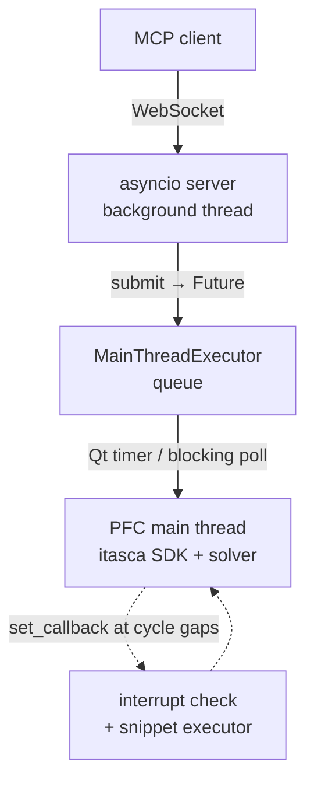

# itasca-mcp-bridge

[English](README.md) | [简体中文](README.zh-CN.md)

[](https://pypi.org/project/itasca-mcp-bridge/)

Runtime bridge that runs inside an ITASCA product process (PFC, FLAC3D, ...)
and exposes the product's Python SDK as a WebSocket API, enabling execution
tools for MCP servers such as [pfc-mcp](https://pypi.org/project/pfc-mcp/).

The bridge is product-neutral: it drives the host through the shared ITASCA
command language / Python SDK rather than any product-specific API.

## Features

- **Async tasks with progress polling.** Submit a long simulation script
  (`pfc_execute_task`) and poll its status and paginated output while it
  runs (`pfc_check_task_status`).
- **Live REPL during a run.** Run `pfc_execute_code` against the running
  task's namespace at any time to inspect state or tune parameters
  mid-cycle — no need to bake probes into the script up front.
- **Graceful interrupt.** Stop a long cycling task on request
  (`pfc_interrupt_task`) without killing the product.
- **Unified output capture.** Python `print` and product console output
  (`itasca.command()` tables, list dumps, summaries) are interleaved in
  execution order in the task log.

## Architecture

ITASCA's Python SDK is main-thread-only, so the bridge keeps the
simulation on the main thread and serves remote requests around it with
three parts:



- **WebSocket server (background thread).** An asyncio server receives
  messages, hands the work to the main thread, and awaits a `Future`. It
  never touches the SDK directly, so lightweight calls (status, interrupt)
  stay responsive even while a long task runs.
- **Main-thread queue.** `MainThreadExecutor` holds a thread-safe queue
  that the main thread drains — via a Qt timer in GUI mode, or a blocking
  poll in console mode. Submitted task scripts (`pfc_execute_task`) run
  here.
- **Cycle-gap callbacks.** A cycling task holds the main thread, so two
  `itasca.set_callback` hooks keep it reachable: an interrupt check that
  stops the run (`pfc_interrupt_task`), and a snippet executor that runs
  `pfc_execute_code` REPL calls in the gaps between cycles — sharing the
  task's `__main__` namespace for live inspection and tuning.

## Quick Start

Run inside the product's Python (GUI IPython console or console CLI):

### Install from PyPI

In the product's IPython console:

```python
from pip._internal.cli.main import main as pip_main
pip_main(["install", "--user", "itasca-mcp-bridge"])

import itasca_mcp_bridge
itasca_mcp_bridge.start()
```

`websockets` is pulled in automatically with a version matched to the
embedded Python (`9.1` for Python 3.6, `16.0` for Python 3.10). If it is
missing or mismatched, install it the same way (`pip_main(["install",
"--user", "websockets==9.1"])` on Python 3.6, `websockets==16.0` on 3.10).

### Run from a source checkout

```python
%run C:/path/to/itasca-mcp-bridge/start_bridge.py
```

> Use forward slashes in the path. Do not wrap it in quotes.

Code changes take effect on the next `%run`, so this is the preferred
workflow during development.

The bridge auto-detects the runtime: a Qt timer in GUI mode, a blocking
loop in console mode.

Expected output:

```text
============================================================
Itasca MCP Bridge Server
============================================================
  URL:  ws://localhost:9001
  Log:  /your-working-dir/.itasca-mcp-bridge/bridge.log
============================================================
```

## Requirements

- An ITASCA product with an embedded Python interpreter.
  - Verified: PFC 6.0 / 7.0 / 9.0.
  - FLAC3D: the bridge's core SDK/command mechanisms are verified
    compatible; full end-to-end validation is in progress.
- Python >= 3.6 (PFC 6/7 use Python 3.6; PFC 9 uses Python 3.10).
- `websockets` (`==9.1` on Python 3.6, `==16.0` on Python 3.10),
  installed automatically as a dependency.

## Troubleshooting

| Symptom | Fix |
|---------|-----|
| Server won't start | Re-run the install/start steps in the product's IPython console; check `.itasca-mcp-bridge/bridge.log` |
| `websockets` version mismatch | In the product IPython console: `from pip._internal.cli.main import main as pip_main; pip_main(["install", "--user", "websockets==16.0"])` (use `9.1` on Python 3.6) |
| Port in use | `itasca_mcp_bridge.start(port=9002)`, then point your MCP client's bridge URL at `ws://localhost:9002` |
| Connection failed | Confirm the bridge is running and the port is reachable; see `.itasca-mcp-bridge/bridge.log` |
| No task execution / MCP cannot connect | If execution tools return `ok=false`, `error.code=bridge_unavailable`, `error.details.reason=cannot connect to bridge service`, confirm `itasca_mcp_bridge.start()` is running and your MCP client's bridge URL matches |

## Relationship to MCP servers

This package is the in-process runtime only. Pair it with an MCP server
that speaks its WebSocket protocol — for example
[pfc-mcp](https://pypi.org/project/pfc-mcp/) — for full client setup.

License: MIT.
