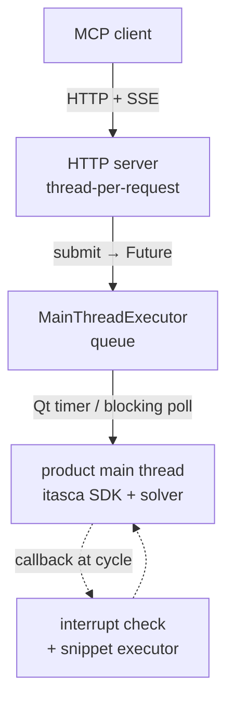

# itasca-mcp-bridge

[English](README.md) | [简体中文](README.zh-CN.md)

[](https://pypi.org/project/itasca-mcp-bridge/)

Runtime bridge that runs inside an ITASCA product process (PFC, FLAC, ...)
and exposes the product's Python SDK as an HTTP API, enabling execution
tools for MCP servers such as [itasca-mcp](https://pypi.org/project/itasca-mcp/).

The bridge is product-neutral: it drives the host through the shared ITASCA
command language / Python SDK rather than any product-specific API.

## Features

- **Async tasks with progress polling.** Submit a long simulation script
  (`execute_task` message) and poll its status and paginated output while
  it runs (`check_task_status`).
- **Live REPL during a run.** Send `execute_code` against the running
  task's namespace at any time to inspect state or tune parameters
  mid-cycle — no need to bake probes into the script up front.
- **Graceful interrupt.** Stop a long cycling task on request
  (`interrupt_task`) without killing the product.
- **Unified output capture.** Python `print` and product console output
  (`itasca.command()` tables, list dumps, summaries) are interleaved in
  execution order in the task log.

## Architecture

ITASCA's Python SDK is main-thread-only, so the bridge keeps the
simulation on the main thread and serves remote requests around it with
three parts:



- **HTTP server (thread-per-request).** A stdlib `http.server` (no asyncio,
  no third-party dependency) serves each request on its own thread, hands the
  work to the main thread, and awaits a `Future`. It never touches the SDK
  directly, so lightweight calls (status, interrupt) stay responsive even
  while a long task runs. Request/response is plain `POST /<command>`; the one
  server→client doorbell (`task_status_changed`) is pushed over a single
  long-lived `GET /events` Server-Sent Events stream.
- **Main-thread queue.** `MainThreadExecutor` holds a thread-safe queue
  that the main thread drains — via a Qt timer in GUI mode, or a blocking
  poll in console mode. Submitted task scripts (`execute_task`) run here.
- **Cycle-gap callbacks.** A cycling task holds the main thread, so two
  `itasca.set_callback` hooks keep it reachable: an interrupt check that
  stops the run (`interrupt_task`), and a snippet executor that runs
  `execute_code` REPL calls in the gaps between cycles — sharing the
  task's `__main__` namespace for live inspection and tuning.

## HTTP protocol

The bridge is the source of truth for the wire contract — MCP servers such
as itasca-mcp are clients of it. Each request is a `POST /<command>` whose
body is a JSON object carrying a `request_id`; the JSON response echoes the
`request_id`. The server→client doorbell rides a single long-lived
`GET /events` SSE stream (payload-free `task_status_changed` events that
prompt the client to re-poll), and `GET /health` is a liveness probe. The
commands are product-neutral:

| `POST /<command>` | Purpose | Key body fields |
|---|---|---|
| `execute_task` | Submit a file-backed script as a tracked async task | `task_id`, `script_path`, `description` |
| `check_task_status` | Poll a task's status and paginated log | `task_id`, `skip_newest`, `limit`, `filter_text` |
| `list_tasks` | List known tasks | `offset`, `limit` |
| `interrupt_task` | Request a graceful interrupt of a running task | `task_id` |
| `execute_code` | Run a snippet in the running task's `__main__` (sync REPL) | `code`, `timeout_ms` |

## Quick Start

Run inside the product's Python (GUI IPython console or console CLI):

### Install from PyPI

In the product's IPython console:

```python
from pip._internal.cli.main import main as pip_main
pip_main(["install", "--user", "itasca-mcp-bridge"])

import itasca_mcp_bridge
itasca_mcp_bridge.start()
```

The bridge is stdlib-only (`http.server` + Server-Sent Events), so there is
no third-party dependency to install or version-match — it lands cleanly in
any ITASCA embedded Python (3.6+) with no pins.

On every `start()` the bridge checks PyPI for a newer release (5-second
timeout; the Tsinghua mirror is tried when pypi.org is unreachable) and
self-upgrades before starting. The check is best-effort -- offline
machines and failed installs fall back to the installed version. To pin
the installed version, call `start(auto_upgrade=False)` or set the
environment variable `ITASCA_MCP_BRIDGE_AUTO_UPGRADE=0`. Corporate
mirrors can be configured with `ITASCA_MCP_PIP_INDEX_URL`.

After a self-upgrade the banner is followed by a short "What's new" list
of the release highlights you just received; call
`itasca_mcp_bridge.whats_new()` to reprint it anytime.

### Run from a source checkout

```python
%run C:/path/to/itasca-mcp-bridge/start_bridge.py
```

> Use forward slashes in the path. Do not wrap it in quotes.

Code changes take effect on the next `%run`, so this is the preferred
workflow during development.

The bridge auto-detects the runtime: a Qt timer in GUI mode, a blocking
loop in console mode.

Expected output:

```text
============================================================
Itasca MCP Bridge Server
============================================================
  Version:  0.4.2
  URL:      http://localhost:9001
  Log:      /your-working-dir/.itasca-mcp-bridge/bridge.log
============================================================
```

## Requirements

- An ITASCA product with an embedded Python interpreter.
  - Verified: PFC 6.0 / 7.0 / 9.0.
  - FLAC3D: the bridge's core SDK/command mechanisms are verified
    compatible; full end-to-end validation is in progress.
- Python >= 3.6 (PFC 6/7 use Python 3.6; PFC 9 uses Python 3.10).
- No third-party runtime dependency: the transport is stdlib-only
  (`http.server` + Server-Sent Events).

## Troubleshooting

| Symptom | Fix |
|---------|-----|
| Server won't start | Re-run the install/start steps in the product's IPython console; check `.itasca-mcp-bridge/bridge.log` |
| Port in use | `itasca_mcp_bridge.start(port=9002)`, then point your MCP client's bridge URL at `http://localhost:9002` |
| Connection failed | Confirm the bridge is running and the port is reachable; see `.itasca-mcp-bridge/bridge.log` |
| No task execution / MCP cannot connect | If execution tools return `ok=false`, `error.code=bridge_unavailable`, `error.details.reason=cannot connect to bridge service`, confirm `itasca_mcp_bridge.start()` is running and your MCP client's bridge URL matches |

## Relationship to MCP servers

This package is the in-process runtime only. Pair it with an MCP server
that speaks its HTTP protocol — for example
[itasca-mcp](https://pypi.org/project/itasca-mcp/) — for full client setup.

License: MIT.
