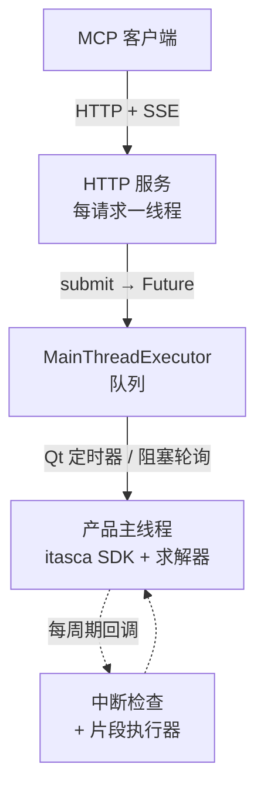

# itasca-mcp-bridge

[English](README.md) | [简体中文](README.zh-CN.md)

[](https://pypi.org/project/itasca-mcp-bridge/)

运行在 ITASCA 产品进程内（PFC、FLAC 等）的 bridge，把产品的 Python SDK
以 HTTP API 暴露出来，为 [itasca-mcp](https://pypi.org/project/itasca-mcp/)
等 MCP 服务端提供执行类工具能力。

本 bridge 与具体产品解耦：它通过 ITASCA 通用命令语言 / Python SDK 驱动宿主，
而非任何产品专有 API。

## 功能

- **异步任务 + 进度轮询。** 提交长仿真脚本（`execute_task` 消息），运行期间轮询
  其状态和分页输出（`check_task_status`）。
- **运行中实时 REPL。** 随时对运行中任务的命名空间发送 `execute_code`，在
  循环途中检查状态或调参——无需预先把探针写进脚本。
- **优雅中断。** 按需终止长循环任务（`interrupt_task`），不杀进程。
- **统一输出捕获。** Python `print` 与产品控制台输出（`itasca.command()` 的表格、
  列表转储、命令摘要）按执行顺序交错记入任务日志。

## 架构

ITASCA 的 Python SDK 只能在主线程使用，因此 bridge 让仿真留在主线程，并用三个
部件在其周围响应远程请求：



- **HTTP 服务（每请求一线程）。** 基于标准库 `http.server`（无 asyncio、
  无第三方依赖），每个请求在自己的线程上服务，把工作交给主线程，然后
  await 一个 `Future`。它从不直接碰 SDK，因此即便长任务在跑，轻量调用
  （查状态、中断）也保持响应。请求/响应是普通的 `POST /<command>`；唯一的
  服务端→客户端门铃（`task_status_changed`）通过一条长连接的
  `GET /events` Server-Sent Events 流推送。
- **主线程队列。** `MainThreadExecutor` 持有一个线程安全队列，由主线程排空——
  GUI 模式用 Qt 定时器，控制台模式用阻塞轮询。提交的任务脚本
  （`execute_task`）在这里运行。
- **周期间隙回调。** 循环中的任务会占住主线程，因此用两个 `itasca.set_callback`
  钩子保持可达：一个中断检查负责终止运行（`interrupt_task`），一个片段执行器
  在周期间隙运行 `execute_code` 的 REPL 调用——并与任务共享同一个 `__main__`
  命名空间，从而支持运行途中的实时检查与调参。

## HTTP 协议

bridge 是 wire 契约的唯一真源——itasca-mcp 等 MCP 服务端都是它的客户端。
每条请求是一个 `POST /<command>`，请求体是带 `request_id` 的 JSON 对象，
JSON 响应回显同一个 `request_id`。服务端→客户端门铃通过一条长连接的
`GET /events` SSE 流推送（无负载的 `task_status_changed` 事件，提示客户端
重新轮询），`GET /health` 是存活探针。命令与具体产品无关：

| `POST /<command>` | 用途 | 关键请求体字段 |
|---|---|---|
| `execute_task` | 提交文件脚本作为受跟踪的异步任务 | `task_id`、`script_path`、`description` |
| `check_task_status` | 轮询任务状态与分页日志 | `task_id`、`skip_newest`、`limit`、`filter_text` |
| `list_tasks` | 列出已知任务 | `offset`、`limit` |
| `interrupt_task` | 请求优雅中断运行中的任务 | `task_id` |
| `execute_code` | 在运行中任务的 `__main__` 里执行片段（同步 REPL） | `code`、`timeout_ms` |

## 快速开始

在产品的 Python 环境中运行（GUI IPython 控制台或控制台 CLI）：

### 从 PyPI 安装

在产品的 IPython 控制台中：

```python
from pip._internal.cli.main import main as pip_main
pip_main(["install", "--user", "itasca-mcp-bridge"])

import itasca_mcp_bridge
itasca_mcp_bridge.start()
```

bridge 仅依赖标准库（`http.server` + Server-Sent Events），因此没有第三方
依赖需要安装或匹配版本——它可干净地装入任意 ITASCA 内嵌 Python（3.6+），
无需任何版本钉死。

每次 `start()` 时 bridge 会检查 PyPI 是否有新版本（5 秒超时；pypi.org
不可达时回退到清华镜像），有则先自动升级再启动。检查是尽力而为的——
离线或安装失败都会回退到已安装版本直接启动。如需锁定当前版本，调用
`start(auto_upgrade=False)` 或设置环境变量
`ITASCA_MCP_BRIDGE_AUTO_UPGRADE=0`。企业内部镜像可通过
`ITASCA_MCP_PIP_INDEX_URL` 配置。

自动升级完成后，横幅下方会附上一份简短的 "What's new"，列出这次升级
带来的改进；随时可调用 `itasca_mcp_bridge.whats_new()` 重新查看。

### 从源码运行

```python
%run C:/path/to/itasca-mcp-bridge/start_bridge.py
```

> 路径使用正斜杠，不要加引号。

修改代码后重新 `%run` 即可生效，开发时推荐这种方式。

Bridge 会自动检测运行环境：GUI 使用 Qt 定时器，控制台使用阻塞循环。

预期输出：

```text
============================================================
Itasca MCP Bridge Server
============================================================
  Version:  0.4.1
  URL:      http://localhost:9001
  Log:      /your-working-dir/.itasca-mcp-bridge/bridge.log
============================================================
```

## 运行要求

- 带内嵌 Python 解释器的 ITASCA 产品。
  - 已验证：PFC 6.0 / 7.0 / 9.0。
  - FLAC3D：bridge 的核心 SDK / 命令机制已验证兼容，端到端完整验证进行中。
- Python >= 3.6（PFC 6/7 用 Python 3.6，PFC 9 用 Python 3.10）。
- 无第三方运行时依赖：传输层仅用标准库（`http.server` + Server-Sent Events）。

## 故障排查

| 现象 | 处理方式 |
|---------|-----|
| 服务无法启动 | 在产品 IPython 控制台中重新执行安装 / 启动步骤；查看 `.itasca-mcp-bridge/bridge.log` |
| 端口被占用 | `itasca_mcp_bridge.start(port=9002)`，并把 MCP 客户端的 bridge 地址指向 `http://localhost:9002` |
| 连接失败 | 确认 bridge 正在运行且端口可达，查看 `.itasca-mcp-bridge/bridge.log` |
| 无法执行任务 / MCP 无法连接 | 若执行工具返回 `ok=false`、`error.code=bridge_unavailable`、`error.details.reason=cannot connect to bridge service`，请确认 `itasca_mcp_bridge.start()` 正在运行，并检查 MCP 客户端的 bridge 地址是否一致 |

## 与 MCP 服务端的关系

本包仅是进程内运行时。请搭配能够使用其 HTTP 协议的 MCP 服务端
（例如 [itasca-mcp](https://pypi.org/project/itasca-mcp/)）完成完整的客户端配置。

许可证：MIT。
