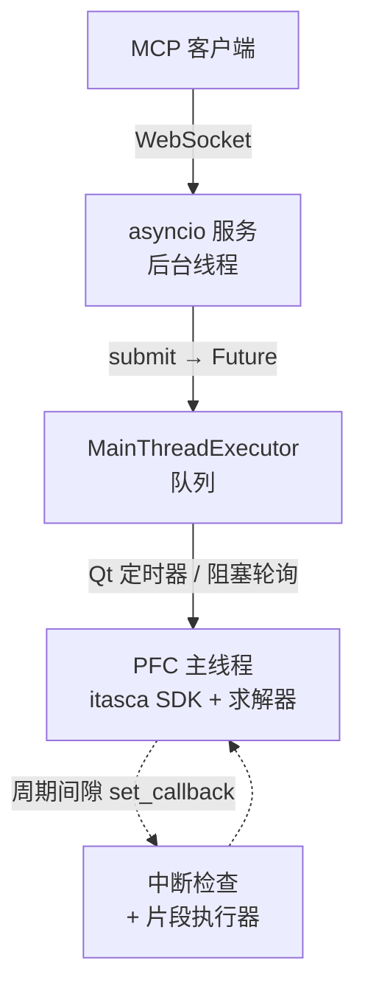

# itasca-mcp-bridge

[English](README.md) | [简体中文](README.zh-CN.md)

[](https://pypi.org/project/itasca-mcp-bridge/)

运行在 ITASCA 产品进程内（PFC、FLAC 等）的 bridge，把产品的 Python SDK
以 WebSocket API 暴露出来，为 [pfc-mcp](https://pypi.org/project/pfc-mcp/)
等 MCP 服务端提供执行类工具能力。

本 bridge 与具体产品解耦：它通过 ITASCA 通用命令语言 / Python SDK 驱动宿主，
而非任何产品专有 API。

## 功能

- **异步任务 + 进度轮询。** 提交长仿真脚本（`pfc_execute_task`），运行期间轮询
  其状态和分页输出（`pfc_check_task_status`）。
- **运行中实时 REPL。** 随时对运行中任务的命名空间执行 `pfc_execute_code`，在
  循环途中检查状态或调参——无需预先把探针写进脚本。
- **优雅中断。** 按需终止长循环任务（`pfc_interrupt_task`），不杀进程。
- **统一输出捕获。** Python `print` 与产品控制台输出（`itasca.command()` 的表格、
  列表转储、命令摘要）按执行顺序交错记入任务日志。

## 架构

ITASCA 的 Python SDK 只能在主线程使用，因此 bridge 让仿真留在主线程，并用三个
部件在其周围响应远程请求：



- **WebSocket 服务（后台线程）。** asyncio 服务接收消息，把工作交给主线程，
  然后 await 一个 `Future`。它从不直接碰 SDK，因此即便长任务在跑，轻量调用
  （查状态、中断）也保持响应。
- **主线程队列。** `MainThreadExecutor` 持有一个线程安全队列，由主线程排空——
  GUI 模式用 Qt 定时器，控制台模式用阻塞轮询。提交的任务脚本
  （`pfc_execute_task`）在这里运行。
- **周期间隙回调。** 循环中的任务会占住主线程，因此用两个 `itasca.set_callback`
  钩子保持可达：一个中断检查负责终止运行（`pfc_interrupt_task`），一个片段执行器
  在周期间隙运行 `pfc_execute_code` 的 REPL 调用——并与任务共享同一个 `__main__`
  命名空间，从而支持运行途中的实时检查与调参。

## 快速开始

在产品的 Python 环境中运行（GUI IPython 控制台或控制台 CLI）：

### 从 PyPI 安装

在产品的 IPython 控制台中：

```python
from pip._internal.cli.main import main as pip_main
pip_main(["install", "--user", "itasca-mcp-bridge"])

import itasca_mcp_bridge
itasca_mcp_bridge.start()
```

`websockets` 会作为依赖自动安装，并按内嵌 Python 版本匹配（Python 3.6 用
`9.1`，Python 3.10 用 `16.0`）。若缺失或版本不匹配，用同样方式安装即可
（Python 3.6：`pip_main(["install", "--user", "websockets==9.1"])`；
Python 3.10 用 `websockets==16.0`）。

### 从源码运行

```python
%run C:/path/to/itasca-mcp-bridge/start_bridge.py
```

> 路径使用正斜杠，不要加引号。

修改代码后重新 `%run` 即可生效，开发时推荐这种方式。

Bridge 会自动检测运行环境：GUI 使用 Qt 定时器，控制台使用阻塞循环。

预期输出：

```text
============================================================
Itasca MCP Bridge Server
============================================================
  URL:  ws://localhost:9001
  Log:  /your-working-dir/.itasca-mcp-bridge/bridge.log
============================================================
```

## 运行要求

- 带内嵌 Python 解释器的 ITASCA 产品。
  - 已验证：PFC 6.0 / 7.0 / 9.0。
  - FLAC3D：bridge 的核心 SDK / 命令机制已验证兼容，端到端完整验证进行中。
- Python >= 3.6（PFC 6/7 用 Python 3.6，PFC 9 用 Python 3.10）。
- `websockets`（Python 3.6 用 `==9.1`，Python 3.10 用 `==16.0`），作为依赖自动安装。

## 故障排查

| 现象 | 处理方式 |
|---------|-----|
| 服务无法启动 | 在产品 IPython 控制台中重新执行安装 / 启动步骤；查看 `.itasca-mcp-bridge/bridge.log` |
| `websockets` 版本不匹配 | 在产品 IPython 控制台中执行 `from pip._internal.cli.main import main as pip_main; pip_main(["install", "--user", "websockets==16.0"])`（Python 3.6 用 `9.1`） |
| 端口被占用 | `itasca_mcp_bridge.start(port=9002)`，并把 MCP 客户端的 bridge 地址指向 `ws://localhost:9002` |
| 连接失败 | 确认 bridge 正在运行且端口可达，查看 `.itasca-mcp-bridge/bridge.log` |
| 无法执行任务 / MCP 无法连接 | 若执行工具返回 `ok=false`、`error.code=bridge_unavailable`、`error.details.reason=cannot connect to bridge service`，请确认 `itasca_mcp_bridge.start()` 正在运行，并检查 MCP 客户端的 bridge 地址是否一致 |

## 与 MCP 服务端的关系

本包仅是进程内运行时。请搭配能够使用其 WebSocket 协议的 MCP 服务端
（例如 [pfc-mcp](https://pypi.org/project/pfc-mcp/)）完成完整的客户端配置。

许可证：MIT。
