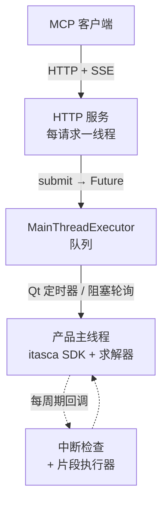

# itasca-mcp-bridge

[English](README.md) | [简体中文](README.zh-CN.md)

[](https://pypi.org/project/itasca-mcp-bridge/)

运行在 ITASCA 产品进程内（PFC、FLAC 等）的 bridge，把产品的 Python SDK
以 HTTP API 暴露出来，为 [itasca-mcp](https://pypi.org/project/itasca-mcp/)
等 MCP 服务端提供执行类工具能力。

本 bridge 与具体产品解耦：它通过 ITASCA 通用命令语言 / Python SDK 驱动宿主，
而非任何产品专有 API。

## 功能

- **异步任务 + 进度轮询。** 提交长仿真脚本（`execute_task` 消息），运行期间轮询
  其状态和分页输出（`check_task_status`）。
- **运行中实时 REPL。** 随时对运行中任务的命名空间发送 `execute_code`，在
  循环途中检查状态或调参——无需预先把探针写进脚本。
- **优雅中断。** 按需终止长循环任务（`interrupt_task`），不杀进程。
- **统一输出捕获。** Python `print` 与产品控制台输出（`itasca.command()` 的表格、
  列表转储、命令摘要）按执行顺序交错记入任务日志。

## 架构

ITASCA 的 Python SDK 只能在主线程使用，因此 bridge 让仿真留在主线程，并用三个
部件在其周围响应远程请求：



- **HTTP 服务（每请求一线程）。** 基于标准库 `http.server`（无 asyncio、
  无第三方依赖），每个请求在自己的线程上服务，把工作交给主线程，然后
  await 一个 `Future`。它从不直接碰 SDK，因此即便长任务在跑，轻量调用
  （查状态、中断）也保持响应。请求/响应是普通的 `POST /<command>`；唯一的
  服务端→客户端门铃（`task_status_changed`）通过一条长连接的
  `GET /events` Server-Sent Events 流推送。
- **主线程队列。** `MainThreadExecutor` 持有一个线程安全队列，由主线程排空——
  GUI 模式用 Qt 定时器，控制台模式用阻塞轮询。提交的任务脚本
  （`execute_task`）在这里运行。
- **周期间隙回调。** 循环中的任务会占住主线程，因此用两个 `itasca.set_callback`
  钩子保持可达：一个中断检查负责终止运行（`interrupt_task`），一个片段执行器
  在周期间隙运行 `execute_code` 的 REPL 调用——并与任务共享同一个 `__main__`
  命名空间，从而支持运行途中的实时检查与调参。

## HTTP 协议

bridge 是 wire 契约的唯一真源——itasca-mcp 等 MCP 服务端都是它的客户端。
每条请求是一个 `POST /<command>`，请求体是带 `request_id` 的 JSON 对象，
JSON 响应回显同一个 `request_id`。服务端→客户端门铃通过一条长连接的
`GET /events` SSE 流推送（无负载的 `task_status_changed` 事件，提示客户端
重新轮询），`GET /health` 是存活探针。命令与具体产品无关：

| `POST /<command>` | 用途 | 关键请求体字段 |
|---|---|---|
| `execute_task` | 提交文件脚本作为受跟踪的异步任务 | `task_id`、`script_path`、`description` |
| `check_task_status` | 轮询任务状态与分页日志 | `task_id`、`skip_newest`、`limit`、`filter_text` |
| `list_tasks` | 列出已知任务 | `offset`、`limit` |
| `interrupt_task` | 请求优雅中断运行中的任务 | `task_id` |
| `execute_code` | 在运行中任务的 `__main__` 里执行片段（同步 REPL） | `code`、`timeout_ms` |
| `list_dialogs` | 产品正在问什么，以及它拿什么按钮在问 | — |
| `answer_dialog` | 点其中某一个按钮 | `id`、`button` |

`GET /dialogs` 与 `list_dialogs` 是同一份负载，给只会用 curl 的客户端。
用途见[随产品一起启动](#随产品一起启动)。

## 快速开始

在产品的 Python 环境中运行（GUI IPython 控制台或控制台 CLI）：

### 从 PyPI 安装

在产品的 IPython 控制台中：

```python
from pip._internal.cli.main import main as pip_main
pip_main(["install", "--user", "itasca-mcp-bridge"])

import itasca_mcp_bridge
itasca_mcp_bridge.start()
```

### 随产品一起启动

手敲那两行，敲一次没问题。问题在于这也意味着：只有有人记得启动时 bridge 才在跑，
而这是一个"客户端本来就该连得上"的服务端，这个默认值是错的。`autostart` 会往
产品的内嵌 Python 里写一个 `sitecustomize.py`，而 CPython 在每次解释器启动时
都会自动导入这个名字：

```console
$ python -m itasca_mcp_bridge autostart install
$ python -m itasca_mcp_bridge autostart status
$ python -m itasca_mcp_bridge autostart remove
```

`install` 会搜索常见的 ITASCA 安装根目录（`--root` 可指定别处，可重复）。
启动产品，几秒后 `http://localhost:9001/health` 就会以
`"runtime_mode": "gui"` 应答。钩子把做过的事记到
`%TEMP%\itasca_mcp_bridge_autostart.log`；如果机器上已经有 bridge 在监听，
它什么都不做。

它是按"跑在别人的 GUI 里"来写的。只有 ITASCA 产品自己的可执行文件才会激活它
（`pfc2d700_gui.exe` 会，自升级用来跑 pip 的 `exe64/python36/python.exe` 不会）。
就绪状态由一个守护线程轮询，`start()` 被**排队到 GUI 线程**上执行——从别的
线程装上去的 Qt 定时器永远不会 tick，那种情况下 `/health` 回 200，而每一个
提交的任务都吊死。控制台构建不碰。不是我们写的 `sitecustomize.py` 会被备份
而不是直接覆盖。

产品每个版本会弹一次"本版改动"的通知窗口。默认**不动它**：一个去关自己没造成的
窗口的 bridge，是在替键盘前的人做决定。

钩子会做的是**看着**这些窗口，看一整个进程生命周期，每冒出一个新弹窗就记一次
——不管有没有被允许去关。第一条引擎命令之前冒出来的弹窗在 `utils/modal_guard`
的视野之外（那个只在 bridge 正处在一条引擎命令里的时候才轮询，而这里什么都还没有）。
它**不会**吊死 bridge：Qt 模态弹窗跑的是嵌套事件循环，任务泵在里面照常 tick
（实测——弹窗挂着时任务仍然往返成功）。它也**不会**弄坏返回的东西：把一个两按钮的
`QMessageBox` 全程架在一次 `plot export bitmap` 上，导出的文件和"屏幕上根本没有弹窗"
时导出的那份**逐字节相同**（43359 字节，sha256 一致，plot 里有 197 个球）。
剩下的就是**沉默**——什么都不报错，所以除了这一行日志没有任何东西会告诉你它在那儿，
而没人回答的弹窗会一直往屏幕最前面翻。日志里那一行是唯一的症状：

```text
a dialog is waiting for a human, leaving it alone: Recover Project File  (nothing else reports it; GET /dialogs lists its buttons)
```

设 `ITASCA_MCP_BRIDGE_AUTOSTART_DISMISS_WINDOWS=1` 会把同一趟巡查变成一只手：
关掉版本通知，并且**回答**那些可见按钮全是确认类的弹窗——`Ok`、`Close`、
`Continue`、`Dismiss`。点这种按钮不算做决定：整个弹窗只有一种可能的结果，
替它点完，键盘前的人并没有损失任何他本可能想要的东西。其余的一律原样留着、
照样上报——带 `Open`/`Discard` 的恢复提示、`OK`/`Cancel` 的保存确认、任何
`Yes` 旁边有 `No` 的东西。这类盒子 `close()` 是关不掉的，这不是风格问题：
Qt 会拒绝关闭一个正处在模态 `exec_()` 里的 widget，不抛异常直接返回，盒子还在
——所以通知是**关**的，没得选的弹窗是**答**的。在 PFC2D 7.00.161 上，答完第一个
又冒出两个，所以这里是扫而不是点一下；三个里的最后一个是只带 `Ok` 的"模型状态
当前标记为不可重复"，它会挡住产品，而且不给你任何绕过去的路。

这个开关是钩子**自己的**策略，而事先写下的策略覆盖不了还没人见过的弹窗——
谁的机器上只有手上这一个版本的软件，谁就正好处在这个位置上。所以同一趟巡查
还会把它看到的东西发布出去，让客户端自己来答：

```console
$ curl -s localhost:9001/dialogs
{"status": "success", "data": {"dialogs": [
  {"id": 1, "title": "Recover Project File",
   "text": "The project file was not saved...",
   "buttons": ["Open", "Discard"], "asks_nothing": false}]}}

$ curl -s -X POST localhost:9001/answer_dialog \
    -d '{"request_id":"1","id":1,"button":"Open"}'
```

快照由 GUI 线程从 widget 上读下来，到手就已经是字符串：标题、正文、以及按钮上的
文字。客户端读它、判断、然后拿里面的 id 和标签回帖。id 按标题发一次就不再变，
标签则要跟弹窗上真实存在的按钮对上——这样一条已经被回收再用的 id 不可能点到
它底下换进来的别的东西。

这一切都不是自动的。点击发生在 GUI 线程、在下一趟巡查里——和 `start()` 需要的是
同一个跳转，只是不用再排一个 QObject，因为巡查本来就已经在那儿、本来就在对的线程上。
请求会等那一趟回来报告结果，等不到就**自己撤回**，而不是对着空房间回 success：
排进队列却没人接，正是这个模块存在的全部理由。如果产品是控制台构建，或者 bridge
是手工从控制台起的，那就没有巡查，回答会直说这一点。正文既读 `QMessageBox.text()`
也读子 label，因为 ITASCA 自己的弹窗是普通 `QWidget`，正文放在 label 里。

它能碰到的是产品**闲着等**的弹窗——Qt 的嵌套事件循环在跑、Python 还在动，
启动时问一句的就是这种。它碰不到从**引擎命令内部**弹出来的那种："Raise Dialog
on Error" 会在整个 `exec()` 期间握着 GIL，任何线程都跑不了 Python，请求根本到不了。
那种弹窗归 `utils/modal_guard`，也只有它能碰到——它自己写明了只在 bridge 正处在
一条引擎命令里的时候轮询，而这里什么都还没有。两者不重叠。

| 环境变量 | 默认 | |
| :--- | :--- | :--- |
| `ITASCA_MCP_BRIDGE_AUTOSTART_PORT` | `9001` | 服务端口 |
| `ITASCA_MCP_BRIDGE_AUTOSTART_HOST` | `localhost` | 绑定地址 |
| `ITASCA_MCP_BRIDGE_AUTOSTART_TIMEOUT` | `120` | 等待引擎和 Qt 的秒数 |
| `ITASCA_MCP_BRIDGE_AUTOSTART_DISMISS_WINDOWS` | 关 | 设为 `1` 则关闭版本通知，并回答没得选的弹窗（无人值守启动） |
| `ITASCA_MCP_BRIDGE_AUTOSTART_LOG` | `%TEMP%\...` | 日志路径；空字符串则不记 |
| `ITASCA_MCP_BRIDGE_ROOTS` | — | 供 `install` 搜索的根目录，`;` 分隔 |

> `exe64/addon.py` 看起来像扩展点，其实不是：**没有任何东西读它**。用标记文件
> 探针实测过——GUI 完全初始化之后标记依然不出现，而且 `addon.py` 在产品可执行
> 文件里出现 **0 次**。真正会被导入的是 `sitecustomize.py`。

### 无头启动（由 agent 拉起）

控制台构建会执行作为第一个参数传入的数据文件，因此 agent 可以自己把整套
环境拉起来——不需要 GUI，也不需要人在键盘前：

```text
model new
python import itasca_mcp_bridge
python itasca_mcp_bridge.start(mode="console")
```

```console
$ pfc3d9_console.exe start_bridge.dat
```

`start()` 不会返回，这一行之后的内容不会执行；其余操作都走 MCP 工具。

bridge 仅依赖标准库（`http.server` + Server-Sent Events），因此没有第三方
依赖需要安装或匹配版本——它可干净地装入任意 ITASCA 内嵌 Python（3.6+），
无需任何版本钉死。

每次 `start()` 时 bridge 会检查 PyPI 是否有新版本（5 秒超时；pypi.org
不可达时回退到清华镜像），有则先自动升级再启动。检查是尽力而为的——
离线或安装失败都会回退到已安装版本直接启动。如需锁定当前版本，调用
`start(auto_upgrade=False)` 或设置环境变量
`ITASCA_MCP_BRIDGE_AUTO_UPGRADE=0`。企业内部镜像可通过
`ITASCA_MCP_PIP_INDEX_URL` 配置。

自动升级完成后，横幅下方会附上一份简短的 "What's new"，列出这次升级
带来的改进；随时可调用 `itasca_mcp_bridge.whats_new()` 重新查看。

### 从源码运行

```python
%run C:/path/to/itasca-mcp-bridge/start_bridge.py
```

> 路径使用正斜杠，不要加引号。

修改代码后重新 `%run` 即可生效，开发时推荐这种方式。

Bridge 会自动检测运行环境：宿主是 GUI 应用时用 Qt 定时器，否则用阻塞循环。
横幅会报告选中了哪一种，所以控制台启动后若发现连不上，先看 `Mode` 那一行。

预期输出：

```text
============================================================
Itasca MCP Bridge Server
============================================================
  Version:  0.5.4
  URL:      http://localhost:9001
  Log:      /your-working-dir/.itasca-mcp-bridge/bridge.log
  Mode:     Qt timer
============================================================
```

## 运行要求

- 带内嵌 Python 解释器的 ITASCA 产品。
  - 已验证：PFC 6.0 / 7.0 / 9.0，GUI 与控制台构建均可。
  - FLAC3D：bridge 的核心 SDK / 命令机制已验证兼容，端到端完整验证进行中。
- Python >= 3.6（PFC 6/7 用 Python 3.6，PFC 9 用 Python 3.10）。
- 无第三方运行时依赖：传输层仅用标准库（`http.server` + Server-Sent Events）。

## 故障排查

| 现象 | 处理方式 |
|---------|-----|
| 服务无法启动 | 在产品 IPython 控制台中重新执行安装 / 启动步骤；查看 `.itasca-mcp-bridge/bridge.log` |
| 端口被占用 | `itasca_mcp_bridge.start(port=9002)`，并把 MCP 客户端的 bridge 地址指向 `http://localhost:9002` |
| 连接失败 | 确认 bridge 正在运行且端口可达，查看 `.itasca-mcp-bridge/bridge.log` |
| 无法执行任务 / MCP 无法连接 | 若执行工具返回 `ok=false`、`error.code=bridge_unavailable`、`error.details.reason=cannot connect to bridge service`，请确认 `itasca_mcp_bridge.start()` 正在运行，并检查 MCP 客户端的 bridge 地址是否一致 |

## 与 MCP 服务端的关系

本包仅是进程内运行时。请搭配能够使用其 HTTP 协议的 MCP 服务端
（例如 [itasca-mcp](https://pypi.org/project/itasca-mcp/)）完成完整的客户端配置。

许可证：MIT。
